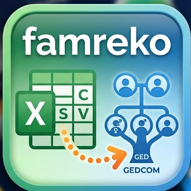

# famrecon

Familien aus Tauf-, Ehe- und Sterberegistern in Tabellenform. Eingabe sind
Tabellen, eine Zeile je Kirchenbucheintrag, so wie Ortsfamilienbuch-Autoren sie
führen, jeder nach eigenem Muster. Ausgabe ist eine GEDCOM-Datei für Gramps,
Ahnenblatt, webtrees oder das Online-OFB bei CompGen. Dazwischen liegt die
Familienrekonstitution: Das Programm verknüpft, was eindeutig belegt ist, und
legt den Rest als Prüfliste vor.

Für jeden Autor, der seine Register in Tabellen hat: xlsx mit Blättern,
mehrere Dateien oder CSV (Trennzeichen und Kodierung werden erkannt). Die
Spaltenzuordnung passt sich der Tabelle an, nicht umgekehrt. Drei Formate
liegen als Beispiel bei: eine Tabelle im Kirchenbuchstil, Tabellen mit
technischen Überschriften, und die aus dem Falkenrath-Stammbaum erzeugten
Register als Mappe und als drei CSV-Dateien (`beispiel/falkenrath-*`). Die
Oberfläche und die Kommandozeile sprechen Deutsch und Englisch.

Gedacht als zeitgemäßer, freier Ersatz für den Excel-nach-GEDCOM-Weg über
Tabellenkalkulations-Makros: ohne Excel-Lizenz, ohne Makros, in Minuten statt Tagen, auf Windows,
Mac und Linux. Python 3.11 oder neuer, eine Abhängigkeit (openpyxl), eine
SQLite-Datei je Projekt.

> **In Arbeit.** Die Kette Einlesen → Normalform → Verknüpfung → GEDCOM
> steht, ist an einer simulierten Wahrheit gemessen und hat eine Oberfläche.
> Was die 35 Beispielzeilen nicht zeigen, zeigen erst große echte Register.

## Durchlauf

    famrecon spalten datei.xlsx                      Blätter und Überschriften zeigen
    famrecon zuordnung datei.xlsx -o zuordnung.toml      Spaltenzuordnung vorschlagen
    famrecon bau zuordnung.toml datei.xlsx               nach Zuordnung einlesen -> daten/projekt.db
    famrecon verknuepfen                              Personen und Familien bilden
    famrecon familien                                 Familien mit Kindern zeigen
    famrecon pruefliste                               unsichere Zuordnungen zeigen
    famrecon personen                                 Personen in Normalform zeigen
    famrecon gedcom -o ausgabe/projekt.ged            GEDCOM 5.5.1 schreiben
    famrecon pruefe daten/projekt.db ausgabe/projekt.ged   jede Tabellenzeile in der GEDCOM wiedergefunden?
    famrecon stand                                    was in der Projektdatei steht

Jeder Autor führt seine Tabellen anders. Deshalb gibt es innen einen festen
Feldkatalog (`python3 -m famrecon.katalog`, je Feld mit Rang: Pflicht, hilft
beim Verknüpfen, ergänzend) und außen eine kleine Zuordnung je Autor: welches
Blatt welches Register ist und welche Spalte welches Feld. `famrecon zuordnung`
schlägt sie aus Überschriften und Beispielwerten vor, mit Sicherheitsgrad je
Spalte; der Mensch sieht die TOML durch und korrigiert, was „unsicher" oder
„???" ist. Mehrere Spalten können ein Feld bilden (vierzig Patenspalten werden
zu `paten`), und was in der Tabelle „k.A." oder „—" heißt, gilt als nicht
angegeben, der Zellinhalt bleibt aber erhalten. Fertige Zuordnungen werden im
Repository gesammelt; wer ein bekanntes Format benutzt, muss nichts tun.
Zwei Formate liegen als Beispiel bei, beide vom Werkzeug selbst zugeordnet:
eine Tabelle im Kirchenbuchstil mit sprechenden Überschriften und vierzig Patenspalten
([`beispiel/kirchenbuchstil.toml`](beispiel/kirchenbuchstil.toml)) und die Hollerbach-Tabellen
mit technischen Überschriften wie `vn_vater_braeu`, Kirchenbuchform in
`_kb`-Spalten und drei Dateien statt drei Blättern
([`beispiel/technisch.toml`](beispiel/technisch.toml)). Rollen dürfen geschachtelt
sein: `braut_vater_name` ist der Nachname des Vaters der Braut.

## Wie es arbeitet

1. **Normalform** (`normalform.py`, `kern.py`). Personenzeilen wie „Haag,
   Nicolaus, weyl., gewesener adelicher Kutscher" werden Name, Vorname,
   Sterbevermerk, Beruf. Marker: „(W)" verwitwet, „(in)" weiblich, „geb. X"
   Geburtsname, „N./NN." unbekannt, „?" unsicher, „Rosenfeld von" wird
   „von Rosenfeld", „Mädchen - totgeboren" wird Totgeburt. Alter in sechs
   Schreibweisen wird zu Tagen, daraus ein berechnetes Geburtsdatum (CAL).
   Nachnamen bekommen einen Lautschlüssel (Kölner Phonetik: Haag = Hag,
   Kriehmann = Kriemann), Vornamen eine Einheitsform (Nicolaus = Nikolaus,
   Hanß = Johann). Der Rohwert bleibt daneben erhalten.
2. **Verknüpfen** (`verknuepfen.py`). Alle Einträge laufen chronologisch
   durch, die Register gemischt, weil jeder Eintrag die späteren ankert.
   Taufe: Elternfamilie über Vater und Mutter suchen, sonst anlegen.
   Trauung: Brautleute über Name, Vorname, Alter und genannte Eltern suchen;
   genannte Eltern werden zur Elternfamilie, ein voriger Mann zur Vorehe.
   Tod: über Name, Vorname, Geburt aus dem Alter, Vater, Ehepartner und
   Rückverweise; Vetos bei „ledig" ohne passenden Vater und „verheiratet"
   ohne passenden Partner. Punkte und Vetos stammen aus einer Pipeline, die
   an 2.800 Hollerbacher Einträgen eingestellt wurde. Jede Zuordnung bekommt
   eine Stufe (sicher, wahrscheinlich, unsicher, neu) und eine Begründung;
   knappe Fälle landen in der Prüfliste.
3. **GEDCOM 5.5.1** (`gedcom.py`). Geburt und Taufe aus dem Taufeintrag mit
   Paten als Notiz, Trauung mit Zeugen und Pfarrer, Tod und Begräbnis mit
   Todesursache und Alter, Berufe je Nennung mit Datum, jedes Ereignis mit
   Quelle und Fundstelle (Buch, Seite, Nummer). Geburtsname als erster Name,
   Ehename als zweiter, abweichende Schreibungen der Einträge als weitere
   Namen (aka). Was kein Feld hat, wird Notiz; unsichere Zuordnungen tragen
   einen Vermerk mit den Alternativen.
4. **Prüfkette.** `famrecon pruefe` sucht jede Tabellenzeile über ihre
   Fundstelle in der GEDCOM wieder und prüft alle Verweise (Exit 1, wenn
   etwas fehlt). `make gramps` lässt Gramps die Datei einlesen und seine
   Plausibilitätsprüfung laufen; `make plausibilitaet` wendet den
   Regelkatalog aus `pruefungen/` an (64 Regeln, aus db-blank übernommen).
5. **Geplant:** Prüfliste im Browser (zwei Einträge nebeneinander, gleiche
   Person ja, nein, später; Entscheidungen werden gespeichert und schlagen
   die Rechnung).

An den 35 Beispielzeilen im Kirchenbuchstil entstehen 76 Personen und 33 Familien, darunter
die von Hand erkannten: Eberle mit drei Taufen und dem Kindstod, Haag/Hag mit
Taufe, Kindstod, Rückverweis und der Hochzeit des Sohnes unter anderer
Schreibweise, Ohringer mit der Sohneshochzeit 27 Jahre nach der Trauung.

## Messen statt schauen

    famrecon simuliere beispiel/falkenrath.ged -o daten/f/register.xlsx [--rauschen 0.3]
    famrecon zuordnung daten/f/register.xlsx -o daten/f/z.toml
    famrecon bau daten/f/z.toml daten/f/register.xlsx -o daten/f/projekt.db
    famrecon verknuepfen daten/f/projekt.db
    famrecon messen daten/f/projekt.db

Aus einer sauberen GEDCOM entstehen die drei Register rückwärts, jede
genannte Person mit versteckter Kennung. Nach dem Verknüpfen zählt `messen`
paarweise: sollten zusammen, sind zusammen, Treffer, verpasst, falsch, daraus
Präzision und Vollständigkeit, dazu die Listen der falsch zusammengelegten und
der zersplitterten Personen. Dann dasselbe für die Struktur: Paare (Mann und
Frau) und Kinder je Paar gegen das Original. Das ist der Rundlauf GEDCOM →
Register → famrecon → GEDCOM, strukturgleich statt bytegleich.

Stand an Falkenrath: Präzision 0,994, Vollständigkeit 0,993, 152 von 153
Paaren, 331 von 337 Kindern. Der Rest sind Geschwister mit demselben Vornamen
und Kinder, die in den Demodaten vor ihrer Geburt sterben. Das misst die Mechanik (Punkte, Vetos,
Altersfenster), nicht die Normalform; eine GEDCOM ist sauberer als ein
Kirchenbuch. `--rauschen` streut Vornamenvarianten, Rufnamen, Endungen und
Lücken ein. Prüfdatei ist der erfundene Falkenrath-Stammbaum (CC0, 492
Personen); `tests/test_messung.py` hält die Untergrenzen fest.

## Oberfläche

    famrecon start                 http://127.0.0.1:8765 im Browser, nur auf diesem Rechner

Die Startdateien `famrecon starten (Windows).bat` und `famrecon starten
(Linux+Mac).command` tun dasselbe per Doppelklick. Ein Projekt ist ein Ordner
unter `daten/`: Tabellen hochladen, Zuordnung mit Beispielwerten durchsehen,
bauen und verknüpfen, Personen und Familien ansehen, Prüfliste, GEDCOM mit
Abgleich. Die Prüfliste zeigt je Fall die Nennung und alle Personen, zu denen
sie passen könnte, mit ihren Belegen; „ist diese Person“ oder „eigene Person“
wird gespeichert und gilt bei jedem weiteren Lauf. Die Oberfläche ruft dieselben
Module wie die Kommandozeile und entscheidet nichts selbst. Standardbibliothek,
kein Framework, Seiten als HTML-Dateien in `famrecon/web/`.

Oben rechts auf jeder Seite: **? Hilfe** führt zum passenden Abschnitt der
eingebauten Hilfe (`famrecon/web/hilfe/de.html`, `en.html`: jede Seite erklärt,
die Rechenregeln, FAQ, Meldungen), **Beenden** stoppt das Programm. Die Pakete
laufen ohne Konsolenfenster; Meldungen landen in `famrecon.log` im Datenordner.
Ein zweiter Start erkennt das laufende Programm und öffnet nur ein Fenster; ist
der Port belegt, nimmt famrecon einen freien.

## Installieren und Pakete

    pip install .                 Befehl `famrecon` systemweit (Python 3.11+, openpyxl)

Fertige Dateien zum Doppelklick hängen an jedem Release
(`.github/workflows/paket.yml`, PyInstaller, gebaut dort, wo das Zielsystem
läuft, wie wtWin und wtMac in app4webtrees):

    famrecon-windows.exe          Einzeldatei mit Symbol, ohne Konsolenfenster; Windows warnt einmal vor dem unbekannten Herausgeber
    famrecon-macos-arm64.zip      Programmpaket famrecon.app; entpacken, Rechtsklick → Öffnen (unsigniert)
    famrecon_<version>_amd64.deb  Debian/Ubuntu/Mint: Menüeintrag mit Symbol, Befehl `famrecon`
    famrecon-linux-x64            Einzeldatei für andere Linux-Systeme (glibc 2.35+)

Die Einzeldateien legen `daten/` neben sich an. Installierte Pakete (.deb,
.app, Program Files) schreiben in den Datenordner des Benutzers:
`~/.local/share/famrecon`, `~/Library/Application Support/famrecon` oder
`%APPDATA%\famrecon`; der Start meldet den Ordner. Lokal bauen:
`pip install pyinstaller pillow && python -m PyInstaller werkzeuge/famrecon.spec`,
die .deb mit `bash werkzeuge/deb-bauen.sh dist/famrecon out`. Ohne GitHub geht die Windows-Datei
auch auf dem eigenen Laptop: `make bundle` erzeugt `out/famrecon.bundle`, das zusammen mit
`werkzeuge/windows-bauen.ps1` auf den Windows-Rechner kommt; Doppelklick auf das Skript holt den
Quelltext aus dem Bundle, legt eine Python-Umgebung an, testet und baut (Python 3.11+ und Git nötig).

## Sprachen

Anzeigetexte der Kommandozeile und der Oberfläche sind Deutsch im Code
(in den Seiten als `{{Text}}`) und werden über `gettext` übersetzt; Englisch
liegt vollständig in `famrecon/sprachen/en/`. `FAMRECON_SPRACHE=en famrecon stand`
erzwingt eine Sprache, sonst gilt die Systemsprache. Neue Sprache: die
`.po`-Datei kopieren, übersetzen, `make sprachen`.

## Prüfen

    make test                 alle Tests
    make beispiel             das Kirchenbuchstil- Beispiel als Projekt anlegen und bauen
    make PROJEKT=x gedcom     GEDCOM schreiben und gegen die Einträge abgleichen
    make PROJEKT=x gramps     Gramps einlesen und prüfen lassen
    make messung RAUSCHEN=0.3 Rundlauf an der Falkenrath-GEDCOM

## Daten

Alle Beispieldateien in `beispiel/` sind erfunden: der Falkenrath-Stammbaum (CC0),
eine Tabelle im Kirchenbuchstil mit 35 Zeilen und drei Tabellen mit technischen
Überschriften. Echte Register gehören nicht ins Repository; `daten/` und `*.db`
sind ausgenommen.

## Aufbau des Repositorys

    famrecon/            das Programm, ein Modul je Schritt
      katalog.py           Feldkatalog: Rollen, Felder, Ränge, Synonyme
      zuordnung.py         Spaltenzuordnung aus Überschriften und Beispielwerten vorschlagen
      lesen.py             xlsx/CSV nach Zuordnung in die Projektdatei (SQLite, schema.sql)
      normalform.py        Zellen in Werte: Namen zerlegen, Marker, Alter, Daten, Lautschlüssel
      kern.py              je Eintrag und Rolle eine Person in Normalform
      verknuepfen.py       Personen und Familien bilden: Punkte, Vetos, Stufen, Entscheidungen
      gedcom.py            GEDCOM 5.5.1 schreiben
      pruefe.py            Abgleich GEDCOM gegen die Einträge
      simulation.py        aus einer GEDCOM die drei Register erzeugen (Messung)
      messen.py            Verknüpfung gegen die Kennungen der Simulation messen
      cli.py, __main__.py  Kommandozeile `famrecon …`
      i18n.py, sprachen/   Übersetzung (gettext), Englisch vollständig
      web/                 Oberfläche: server.py, vorlagen/ (Seiten), static/, hilfe/ (de, en)
    beispiel/            erfundene Beispieldaten: Kirchenbuchstil, technische Tabellen,
                         Falkenrath-Stammbaum (GEDCOM, CC0) und seine Register als xlsx und CSV
    tests/               unittest, `make test`
    pruefungen/          Regelkatalog mit 64 Plausibilitätsregeln und sein Motor (`make plausibilitaet`)
    werkzeuge/           Bauen und Prüfen: famrecon.spec und start.py (PyInstaller), deb-bauen.sh,
                         windows-bauen.ps1 (Bau auf dem Laptop), Symbole, falkenrath-lauf.sh (Messlauf), gramps-pruefen.sh
    .github/workflows/   paket.yml baut die Pakete für Windows, macOS und Linux
    Makefile             Ziele: test, sprachen, start, bau, gedcom, gramps, plausibilitaet, beispiel, messung
    daten/               lokal, von Git ignoriert: ein Ordner je Projekt (Tabellen, zuordnung.toml, projekt.db, projekt.ged)

Die Startdateien `famrecon starten (…)` im Hauptordner sind für Nutzer des Quelltexts ohne
Kommandozeile: Doppelklick startet die Oberfläche.

## Lizenz

MIT, siehe [LICENSE](LICENSE). Verwandte Werkzeuge desselben Autors:
[ofb-werkstatt](https://github.com/thobgg/ofb-werkstatt) liest Kirchenbuchseiten
per Sprachmodell und gleicht gegen einen Bestand ab; famrecon ist der kleine
Bruder für bereits transkribierte Tabellen.
